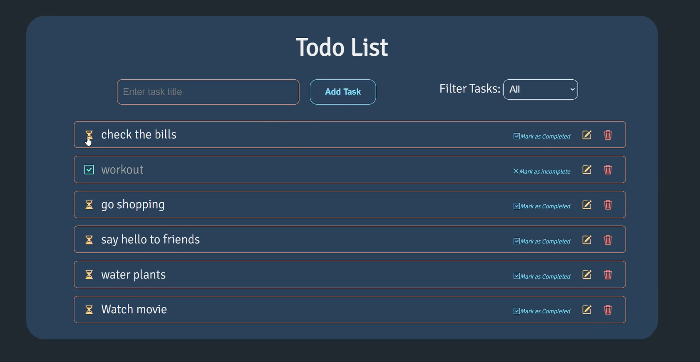

# To-Do List App

A simple and efficient To-Do List application built with React, React-Redux, Redux, Redux Thunk, Bootstrap Icons, and JSON-Server.

## Table of Contents

- [Overview](#overview)
- [Features](#features)
- [Technologies Used](#technologies-used)
- [Installation](#installation)
- [Usage](#usage)
- [Contributing](#contributing)
- [License](#license)

## Overview

The To-Do List app helps you manage your daily tasks efficiently. It allows you to add, delete, and mark tasks as completed. The app is built with a modern JavaScript stack and follows best practices for state management and asynchronous operations.



## Features

- Add new tasks
- Mark tasks as completed
- Update tasks
- Delete tasks
- Filter tasks by completion status
- Persist tasks using JSON-Server

## Technologies Used

- **React**: A JavaScript library for building user interfaces
- **React-Redux**: Official React bindings for Redux
- **Redux**: A Predictable State Container for JS Apps
- **Redux Thunk**: Middleware for Redux to handle asynchronous actions
- **Bootstrap Icons**: Icons for Bootstrap
- **JSON-Server**: A full fake REST API with zero coding

## Installation

Follow these steps to set up the project on your local machine.

1. **Clone the repository:**

   ```bash
   git clone https://github.com/your-username/todo-list-app.git
   cd todo-list-app
   ```

2. **Install dependencies:**

   ```bash
   npm install
   ```

3. **Install JSON-Server globally (if not already installed):**

   ```bash
   npm install -g json-server
   ```

4. **Start JSON-Server:**

   ```bash
   json-server --watch db.json --port 8000
   ```

   This will start JSON-Server on `http://localhost:8000`.

5. **Start the React application:**

   ```bash
   npm start
   ```

   This will start the React app on `http://localhost:3000/todolist`.

## Usage

1. Open your browser and navigate to `http://localhost:3000/todolist`.
2. Add tasks using the input field and the "Add Task" button.
3. Mark tasks as completed by clicking the checkbox.
4. Delete tasks by clicking the delete icon.
5. Update tasks as you wish
6. Filter them by completion status

---

### Contributing

Contributions are welcome! Please follow the steps to contribute:

1. Fork the repository.
2. Create a new branch (git checkout -b feature-branch).
3. Make your changes and commit them (git commit -m 'Add new feature').
4. Push to the branch (git pushorigin feature-branch).
5. Open a pull request.

### License

This project is licensed under the MIT License - see the LICENSE file for details.

